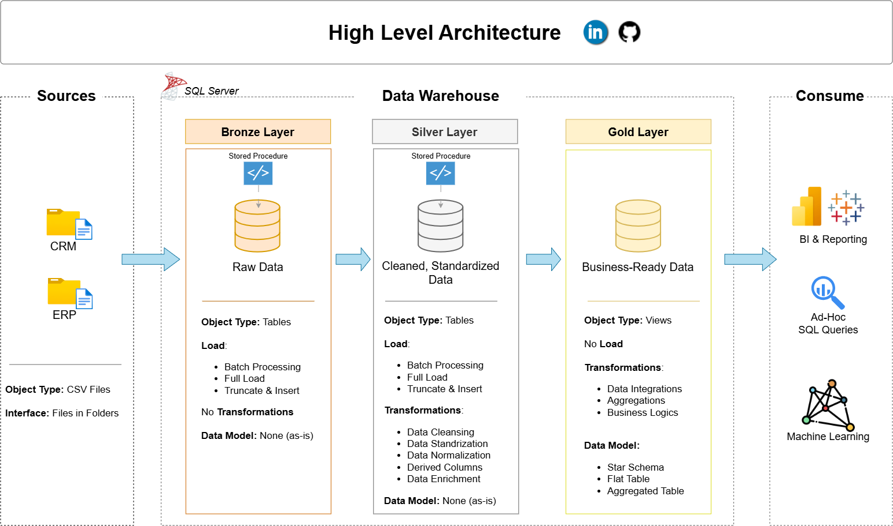
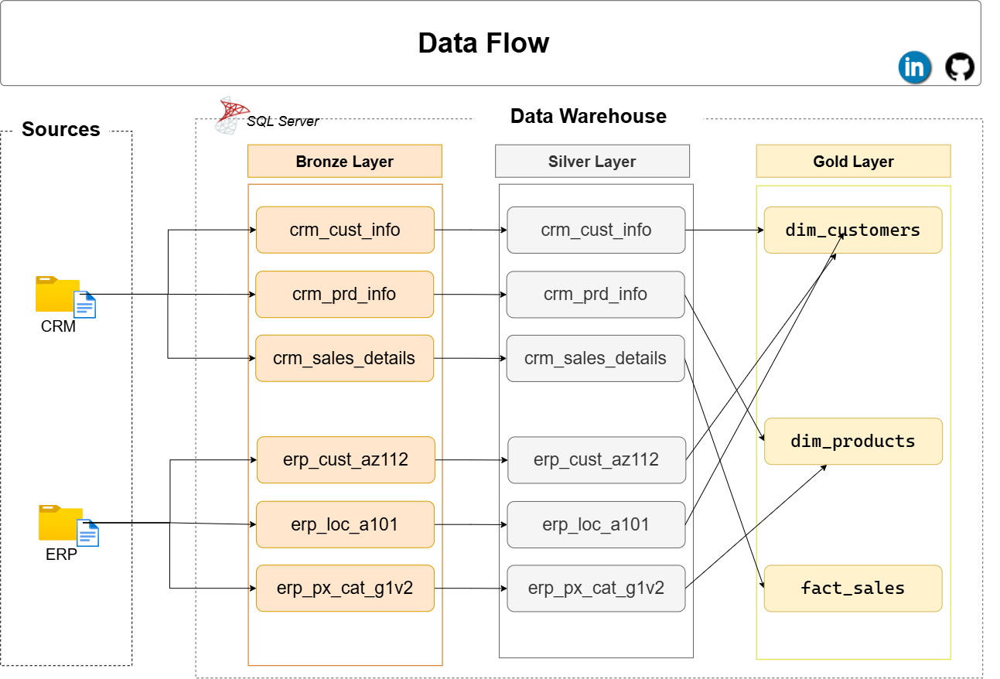
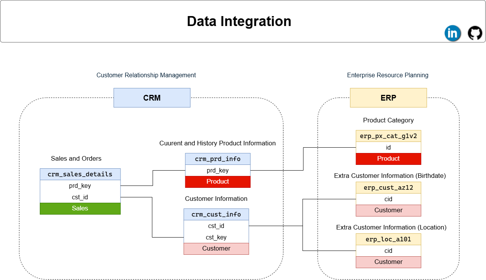

# Enterprise CRM-ERP Data Warehouse (Bronze-Silver-Gold) Pipeline

A SQL Server data warehouse project that ingests CRM and ERP source extracts
and processes them through a medallion architecture (Bronze -> Silver -> Gold)
into analytics-ready tables.

## Status

| Layer  | DDL | Load Logic | Status        |
|--------|-----|------------|---------------|
| Bronze | ✅  | ✅         | Complete      |
| Silver | ✅  | ✅         | Complete      |
| Gold   | ⏳  | ⏳         | Not started   |

## Architecture

This project implements **ELT** (Extract, Load, Transform) rather than a
full end-to-end ETL pipeline:

- **Extraction** — *out of scope.* The pipeline assumes CRM/ERP source data
  has already been extracted to CSV files in `datasets/`. It does not
  connect to any source CRM/ERP system directly; producing those CSVs is a
  separate, upstream process.
- **Bronze (Load)** — raw, unmodified data loaded as-is from the extracted
  CSV files via `BULK INSERT`. No business rules applied; column types are
  widened as needed to avoid truncation on ingestion.
- **Silver (Transform)** — cleansed, standardized, and typed data (e.g. date
  columns cast from raw `INT`/text to `DATE`, business keys and codes
  normalized). Each Silver table carries a `dwh_create_date` audit column.
- **Gold** — business-ready, modeled data (facts/dimensions) for reporting
  and analytics. Not yet built.



## Project Structure

```
crm-erp-data-warehouse/
├── scripts/
│   ├── bronze/
│   │   ├── ddl_bronze.sql           # Creates bronze schema tables
│   │   └── load_bronze_proc.sql     # bronze.load_bronze — BULK INSERT from CSV
│   ├── silver/
│   │   ├── ddl_silver.sql           # Creates silver schema tables
│   │   └── load_silver_proc.sql     # silver.load_silver — Bronze -> Silver transform
│   └── gold/                        # Reserved for Gold layer scripts
├── datasets/                        # Raw CRM/ERP CSV extracts (not tracked in git)
├── docs/                            # Diagrams and planning notes (see below)
├── tests/                           # Validation / data quality test scripts
│   ├── data_quality_checks_bronze.sql
│   └── data_quality_checks_silver.sql
├── .gitignore
└── README.md
```

## Documentation (`docs/`)

### Architecture


### Data Flow



### Data Integration



### Data Model

*Not yet added — planned once the Gold-layer dimensional model is designed.*

### Notes

| File | Description |
|------|--------------|
| `requirements` | Project requirements notes. |
| `source_data_analysis` | Analysis notes on the source CRM/ERP data (structure, quality issues, assumptions). |

> Editable `.drawio` source files for the diagrams above (if kept in the
> repo separately from their `.png` exports) can be opened and edited for
> free at [app.diagrams.net](https://app.diagrams.net) — no account
> required.

## Testing (`tests/`)

- `data_quality_checks_bronze.sql` — diagnostic checks against raw Bronze
  data (nulls, duplicates, untrimmed text, invalid codes, business-rule
  violations) to identify what the Silver transformation needs to fix.
- `data_quality_checks_silver.sql` — post-transformation checks validating
  that `silver.load_silver`'s cleansing rules actually hold; includes notes
  on a few known, currently-unhandled edge cases in the transformation
  logic.

## Prerequisites

- Microsoft SQL Server 2016+
- Permissions: `CREATE TABLE`/`DROP TABLE`/`ALTER` on the target database,
  plus `ADMINISTER BULK OPERATIONS` (or `bulkadmin` role) for the load
  procedure, and file-system read access for the SQL Server service account
  on the machine hosting the source CSVs.

## Setup & Run

1. **Place source files** — copy your CRM/ERP CSV extracts into
   `datasets/` locally (git-ignored; see `.gitignore`).
2. **Create schemas** (if not already present):
   ```sql
   CREATE SCHEMA bronze;
   CREATE SCHEMA silver;
   ```
3. **Bronze layer**
   ```sql
   :r scripts/bronze/ddl_bronze.sql
   :r scripts/bronze/load_bronze_proc.sql
   EXEC bronze.load_bronze;
   ```
4. **Silver layer**
   ```sql
   :r scripts/silver/ddl_silver.sql
   :r scripts/silver/load_silver_proc.sql
   EXEC silver.load_silver;
   ```
5. **Validate** *(optional but recommended)*
   ```sql
   :r tests/data_quality_checks_bronze.sql
   :r tests/data_quality_checks_silver.sql
   ```

> Note: `BULK INSERT` file paths in `load_bronze_proc.sql` are currently
> hard-coded local paths (see script comments). Update these to match your
> environment before running.

## Roadmap

- [x] Silver layer transformation/load procedure
- [x] Data quality / validation scripts in `tests/`
- [x] Silver layer validated against `tests/data_quality_checks_silver.sql` — current dataset passes clean
- [ ] Gold layer dimensional model (facts/dimensions)
- [ ] Data model diagram (`docs/`)
- [ ] Documentation of source-to-target mappings

> Note: a few Silver-layer edge cases are documented but latent (not
> triggered by the current dataset) — see `NOTE:` comments in
> `tests/data_quality_checks_silver.sql` (`prd_nm`, `erp_loc_a101.cid`,
> `erp_px_cat_g1v2.maintenance` not trimmed; sales/quantity/price correction
> logic doesn't chain across fields). Worth fixing before trusting the
> pipeline on a different or larger dataset.

## About Me

**Mohammed Abuteir**
Aspiring Data Engineer | BSc Software Development, Islamic University of Gaza (2019–2023)

I'm a software developer from Gaza working toward a career in data
engineering, currently pursuing a funded Master's abroad in the field. This
project is part of building hands-on experience with enterprise SQL Server
development, ETL pipeline design, and the medallion (Bronze-Silver-Gold)
architecture pattern.

- 📧 [teirmoh@gmail.com](mailto:teirmoh@gmail.com)
- 💻 [github.com/teirmoh](https://github.com/teirmoh)